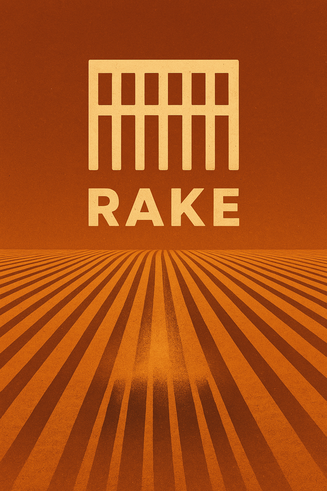

<p align="center">
  
</p>

<p align="center">
  <strong>A vector-first language for CPU SIMD</strong>
</p>

<p align="center">
  <a href="https://rake-lang.org">rake-lang.org</a>
</p>

<p align="center">
  <strong>Release: 0.3.0-alpha.1</strong>
</p>

## What Rake guarantees

Rake lets a programmer describe the native vector structure of a CPU kernel
without writing intrinsics or assembly. One live rack occupies one physical
register of the target profile's vector class. Compilation fails when an
operation would require split vectors, scalar lanes, hidden helper calls, or
spills.

The language contract defines which evaluation graphs an ordinary expression
permits. Rake's typed intermediate representation records the graph selected
for a target, and the scalar interpreter supplies independent executable
semantics for explicit operations and graph-stable fixtures. Optimized native
SSA is the bit-exact reference for a fused expression whose permitted rewrites
change intermediate rounding. Native machine IR, physical allocation, textual
assembly, and disassembly establish how that graph executes on the selected
machine profile.

The production compiler owns source-to-assembly decisions. The system assembler
encodes Rake's textual assembly into an object file and applies relocations. It
doesn't select instructions or allocate registers.

## Current status

Rake is an alpha compiler. The parser recognizes a broad language while the
type checker publishes the source constructs whose semantics it can validate.
Run `rakec --print-capabilities` for that machine-readable frontend contract
and `rakec --print-targets` for native profile shapes and implementation status.

The production `x86-avx2` and `aarch64-neon` slices accept `f32s` crunches
and predicated
`rake` functions with `f32` scalar parameters. Angle brackets mark a uniform
scalar at declaration and use, and therefore expose every broadcast boundary.
Seeing many scalar markers in a kernel should provoke the question: could
these values vary by lane, or be stored and processed more efficiently? Both
slices support arithmetic, fused-graph FMA contraction, square root,
comparisons, mask logic, selection, broadcasts, and source-required FMA.
The AVX2 slice additionally supports strict f32 reductions and inclusive prefix
scans, with exact ascending-lane semantics.
Rake lowers these programs through typed native SSA, target-specific
instruction selection, no-spill register allocation, and GNU assembly syntax:

```sh
nix develop --command dune build
nix develop --command dune exec rakec -- \
  --emit-native-ir --target x86-avx2 program.rk
nix develop --command dune exec rakec -- \
  --emit-asm --target x86-avx2 program.rk
nix develop --command dune exec rakec -- \
  --verify-native --target x86-avx2 -o output.o program.rk
```

`--verify-native` assembles and disassembles the result. Verification rejects
calls, stack use, rack memory, scalarized rack arithmetic, instructions outside
the selected profile's allow-list, and an incorrect selected-FMA count. The
scalar broadcast boundary permits only `vbroadcastss` from an XMM source on
AVX2 or `dup` from lane zero of an AAPCS64 scalar argument on NEON.

The executable AVX2 and NEON rake slices lower tines to mask SSA, sanitize inactive
operands before exception-capable instructions, and implement total
source-priority sweeps with vector blends. The independent interpreter skips
inactive lanes, and runtime tests compare exact binary32 results while checking
that inactive invalid operands don't set floating-point exception flags. `run`
and pack traversal remain frontend-only. The compiler reports that boundary
directly.

Records, tuples, logical mask reductions, reductions and scans outside AVX2,
rearrangement operations, gather/scatter, compression/expansion, lane
insertion/extraction, lambdas, expression pipelines, native non-f32 numeric paths,
and other parsed forms remain unavailable where their contracts or native
lowerings are incomplete.

## Target profiles

A CPU rack is one fixed-width SIMD register. `x86-sse2` and `aarch64-neon`
have four f32 lanes in 128 bits, `x86-avx2` has eight in 256 bits, and
`x86-avx512` has sixteen in 512 bits. The `native` selection resolves the
strongest production profile implemented for the host. An explicit profile
produces reproducible cross-target behavior.

The profile catalog describes intended rack shapes independently of production
backend coverage. At present, `x86-avx2` and `aarch64-neon` have production
native lowerings. The compiler rejects other profiles at the native-backend
boundary. The explicit planned `scalar` profile doesn't claim native SIMD
registers.

`--width` is a compatibility assertion. It must equal the selected profile's
f32 lane count and cannot request a split or scalarized rack. The reserved
`lanes` and `@` expressions mean the profile-derived lane count and zero-based
lane index; they remain unavailable until their type rules, interpreter
semantics, native lowering, and verification are complete.

## Why the notation looks this way

Rake uses a small visual vocabulary for facts that ordinary scalar-looking
syntax tends to hide. `<value>` is uniform across lanes. `#active` is a tine,
drawn like a perforated mask whose open lanes admit values. `| result <|
expression` shows verified vector data flowing from the expression into its
name, while consecutive leading bars align a fused path. Each mark has one
stable role; words carry the surrounding control structure.

## Fused regions

`| name <| expression` creates an immutable fused binding. A supported fused
region is a contiguous pure data-flow graph. It contains no calls, spills,
reloads, hidden scalar lane work, or unsupported instructions. Its live values
must fit the target's physical register budget.

Names inside that graph are readable aliases rather than evaluation or rounding
boundaries. The two `advance` bindings below are optimized as
`positions + velocities * <0.5>`. The AVX2 and NEON backends contract that graph
to one native FMA and remove the dead multiply. The language permits broader
cost-directed rewrites such as reassociation, factoring, distribution, and
common-expression elimination. The current alpha implements transparent alias
substitution, dead-intermediate removal, and multiply-add contraction; the
broader optimizer remains roadmap work.

`fma(a, b, c)` is reserved for code whose correctness specifically depends on
one-rounding fused multiply-add semantics. It records that requirement; it is
not needed to make the optimizer choose a fast FMA. Rake has no slower
user-selectable arithmetic mode.

## Language tour

### Uniform rack arithmetic

A `crunch` applies the same computation to every lane. Angle brackets mark a
scalar literal that is explicitly broadcast into a rack.

<!-- rake-example:crunch:start -->
```rake
crunch advance(positions: f32s, velocities: f32s) -> f32s:
  | scaled: f32s <| velocities * <0.5>
  | result: f32s <| positions + scaled
  return result
```
<!-- rake-example:crunch:end -->

### Safe lane-dependent work

A `rake` names lane masks as tines. The `through` body supplies a candidate for
active lanes. The final `_` sweep arm defines every remaining lane.

<!-- rake-example:safe-through:start -->
```rake
rake safe_root(values: f32s) -> f32s:
  tine #valid when values >= <0.0>

  through #valid else <0.0> into rooted:
    sqrt(values)

  return sweep:
    | #valid => rooted
    | _      => <0.0>
```
<!-- rake-example:safe-through:end -->

The corresponding masked operation set is interpreter-executable and
production-executable on AVX2. Its native SSA contains explicit operand
sanitizers, and emitted functions use YMM mask operations and blends without
scalar lane branches.

### Columnar traversal

A `stack` describes structure-of-arrays fields, a `pack` describes traversed
storage, and `for ... using ... up to ...` processes it in native-rack chunks.

<!-- rake-example:pack-over:start -->
```rake
stack Samples {
  f32: value;
  u8: quality;
}

run scale_values(
  input: pack Samples,
  <count: i64>,
  <scale: f32>
) -> f32:
  for chunk in input using f32s up to <count>:
    let quality: u32s = widen(chunk.quality)
    yield chunk.value * <scale>
```
<!-- rake-example:pack-over:end -->

This example is the canonical source contract. Rake has published the first
pack/`run` semantics and Linux x86-64 System V boundary in
[`docs/spec/02_packs_and_run.md`](docs/spec/02_packs_and_run.md). The native
backend does not implement that boundary yet, so `run` remains
production-unavailable. The retired memref wrapper is not part of the Rake ABI.

## Development checks

Run the focused suite in the pinned Nix environment:

```sh
nix develop --command dune build
nix develop --command bash test/run_tests.sh
nix develop --command bash test/full_tests.sh
nix develop --command dune runtest --force
```

The test corpus separates frontend acceptance, semantic interpretation, native
lowering, runtime behavior, and machine-code verification. A green frontend
test doesn't claim that the same construct is production-executable.
