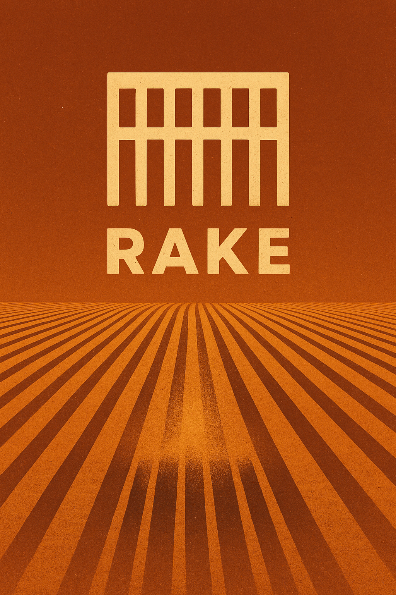

<p align="center">
  
</p>

# Rake

Rake is a programming language for SIMD kernels. Its values are racks, one
vector register each on a physical CPU target and one `v128` value in the
WebAssembly virtual machine. Outside `slow` code, the compiler uses vector
instructions wherever the selected profile supports the source operation, or
it refuses the program. It never replaces rack work with hidden scalar loops
or helper calls. The language and its documentation are at
[rake-lang.org](https://rake-lang.org).

What Rust does for safety with `unsafe {}`, Rake does for speed with
`slow {}`. A run explicitly enters scalar code at `slow {` and resumes vector
work at `}`. [Slow blocks](docs/spec/08_slow_tier.md#slow-blocks) are available
in 0.6.0-beta and in the playground.

Release: 0.6.0-beta.

<!-- rake-check: verify x86-avx2 aarch64-neon wasm-simd128 -->
```rake
scratch advance(positions: f32s, velocities: f32s) -> f32s:
  | scaled <| velocities * <0.5>
  | moved  <| positions + scaled
  moved

tine #valid(values: f32s) means values >= <0.0>

rake safe_root(values: f32s) -> f32s:
  through #valid(values) into rooted:
    sqrt(values)

  sweep:
    | #valid(values) => rooted
    | #valid(values) gaps => <0.0>
```

`<0.5>` is a uniform, one scalar shared by every lane. `#valid` is a reusable
tine predicate, and `through` computes roots only in its selected lanes.
`gaps` selects the complementary lanes, including NaNs. The sweep picks each
lane's result. `| name <| expression` binds a stage of a
fused computation: on AVX2 and NEON, `advance` compiles to one fused
multiply-add.

## Targets

| Profile | Rack | What compiles |
| --- | --- | --- |
| `x86-sse2` | one 128-bit XMM register, 4 `f32` lanes | `f32s` scratches and rakes, as assembly |
| `x86-avx2` | one 256-bit YMM register, 8 `f32` lanes | `f32s` scratches and rakes, as assembly |
| `x86-avx512` | one 512-bit ZMM register, 16 `f32` lanes | `f32s` scratches and rakes, as assembly |
| `aarch64-neon` | one 128-bit vector register, 4 `f32` lanes | `f32s` scratches and rakes, as assembly |
| `wasm-simd128` | one `v128`, 4 `f32` lanes | scratches and rakes over float and integer racks, runs over memory, and whole programs with scalar `slow` code, as C |
| `wasm-simd128-relaxed` | as `wasm-simd128` | adds the relaxed SIMD operations, by opt-in |

The scalar fallback remains WIP (work in progress), and the compiler rejects
code for it. General native runs are also WIP. The unreleased development
compiler compiles slow orchestration with register kernels as native C and
objects. It embeds Rake's selected assembly, checks the kernels in the final
object, and supports uniform `f32` parameters and `f32`, `bool` or `u32` results at the boundary
from slow code. Other native scalar kernel boundaries remain WIP. Platform C
imports and exports, header-backed unions, typed C callbacks and process
arguments are supported too. SSE2, AVX2, AVX-512 and NEON also support
`f32s` traversals that yield a stream or update one mutable stack column,
including a separate destination with its own record layout,
with checked partial racks. These
development additions are absent from the 0.6.0-beta source tag. On
`wasm-simd128`, a whole program becomes one C file
with a C entry point, and every selected instruction is written as one
`wasm_simd128.h` intrinsic.

A whole program has vector runs and scalar slow code. Slow code never holds a
rack, and a scalar becomes a rack only where it is marked:

<!-- rake-check: run 33 -->
```rake
pack Samples {
  f32: value;
  u8: quality;
}

run weigh(input: stack Samples, <count: i64>, <scale: f32>) -> f32:
  for chunk in input using f32s up to <count>:
    let quality = to_f32(bitcast(i32s, widen(chunk.quality)))
    yield chunk.value * <scale> + quality

run running_sum(x: []f32, out: mut []f32, <n: i32>):
  total := <0.0>
  for <i: i32> from <0> up to <n> by <4>:
    total <- total + x[<i>]
    out[<i>] <- total

state calls: i32 := 0

slow main() -> i32:
  values: [8]f32 := [1.0, 2.0, 3.0, 4.0, 5.0, 6.0, 7.0, 8.0]
  qualities: [8]u8 := [0, 1, 0, 1, 0, 1, 0, 1]
  weighed: [8]f32 := [0.0; 8]
  weigh(stack Samples { value: values, quality: qualities }, <8>, <0.5>, weighed)
  sums: [8]f32 := [0.0; 8]
  running_sum(weighed, sums, <8>)
  calls <- calls + 1
  return i32(sums[7] * 4.0) + calls
```

## Using the compiler

The compiler is `rakec`, written in OCaml. The Nix development shell has
everything it needs:

```sh
nix develop --command dune build
nix develop --command dune exec rakec -- --interpret program.rk
nix develop --command dune exec rakec -- --emit-asm --target x86-avx2 -o program.s program.rk
nix develop --command dune exec rakec -- --verify-native --target wasm-simd128 -o program.o program.rk
```

`--interpret` runs `main` in Rake's executable semantics. `--emit-asm` writes
assembly, or C for a whole program. `--verify-native` builds an object,
disassembles it and checks its vector functions against the profile's rules. A
scratch or rake contains only register work from the profile's instruction
list, with no calls and no stack. On x86 and AArch64 each rack is one whole
physical register, and the object has exactly the fused multiply-adds the
compiler selected. On WebAssembly, Rake keeps to the virtual machine's
`v128` values and SIMD instructions. It doesn't try to replace the runtime's
physical register allocation. A wasm run also contains the uniform address,
loop and bounds work written in the source, but it never scalarises rack work.
`rakec --help` lists every mode, `--print-targets` the profiles and
`--print-capabilities` each language feature's status.

## Documentation

The [syntax reference](docs/spec/00_syntax.md) lists every form, and the
pages it links define what each means. [Goals](docs/GOALS.md) states the
language's promises, [the backend](docs/BACKEND.md) how the compiler keeps
them, and [the roadmap](docs/ROADMAP.md) what comes next. [The
playground](docs/PLAYGROUND.md) is an interactive tutorial in twelve lessons,
[the glossary](docs/GLOSSARY.md) defines the terms, and [Rake and other
languages](docs/COMPARISONS.md) and [GPU profiles](docs/GPU.md) set Rake
beside ISPC and Bend 2. The GPU contract is a design, not an implemented
backend. Its first proposed profile maps racks across NVIDIA warp lanes,
emits PTX and verifies the ahead-of-time cubin. It separates checked
execution properties from occupancy, memory costs and elapsed time, which
still need measurement.
[The rakec command](docs/RAKEC.md) lists its modes and options,
[`test/README.md`](test/README.md) describes the tests, and
[`CHANGELOG.md`](CHANGELOG.md) the releases.

## Licence

MIT, in [`LICENSE`](LICENSE).
